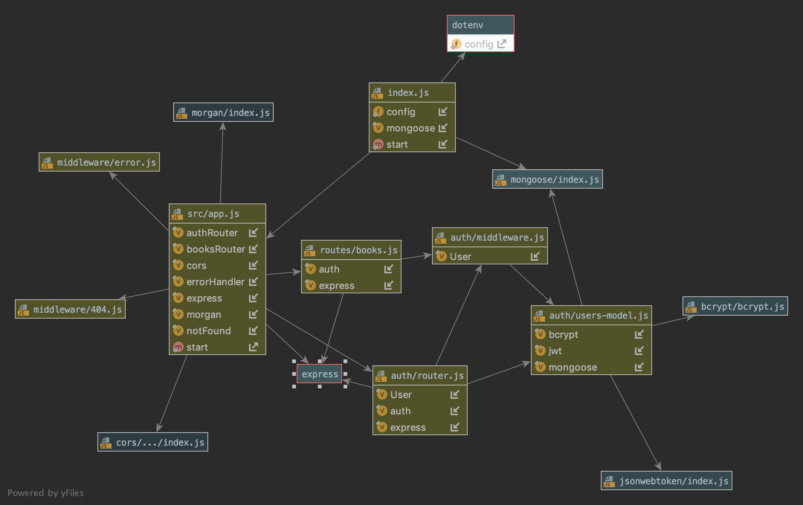

# LAB - 09

 ## API Server

 ### Author: Lillian Gales & Evan Brecht-Curry

 ### Links and Resources
* [submission PR]()
* [travis]()
* [front-end]() 
* [docs](http://localhost:3000/docs/)

 ##### Exported Values and Methods

 ###### 
`get(category) -> promise`
`post(category) -> promise`
`put(category) -> promise`
`delete(category) -> promise`

 `get(product) -> promise`
`post(product) -> promise`
`put(product) -> promise`
`delete(product) -> promise`

 ### Setup
#### `.env` requirements
* `PORT` - 3000

 #### UML
